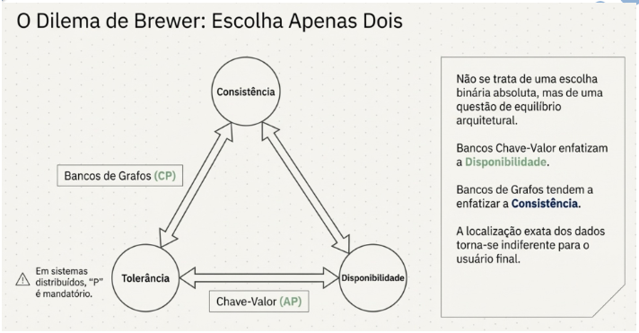
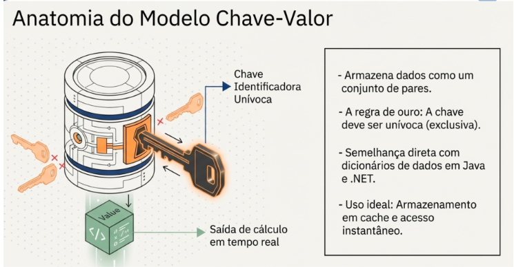

# BD não relacional - Aula 7 - Estudo das categorias de banco de dados nosql

> Segundo Tiwari (2011), o NoSQL é um banco de dados não relacional que também pode ser utilizado como pós relacional, com alta interatividade com Big Data.

Conta com ferramentas próprias como _MapReduce, de clusterização, de tolerância a falhas, de schema-free (organização de dados sem estruturação) e de sharding (fragmentação de dados)_.

Esses bancos não relacionais podem ser divididos pela **função** que desempenham no ***tratamento dos dados***.

A garantia do ACID em NoSQL é mais complexa para a sua garantia, e é aí que surge o teorema de CAP.

> Consistency, Availabity e Network Partition Tolerance – Consistência, Disponibilidade e Tolerância a particionamento) proposto por Brewer (2000).
A sua premissa inicial é que os seguintes requisitos devem ser garantidos:
* Todos os nós devem ter a mesma versão para a garantia da consistência;
* Todas as solicitações por uma cópia dos dados devem estar disponíveis em um dos servidores, a fim de se garantir a disponibilidade;
* O sistema continua com os mesmos dados e propriedades de configurações, mesmo se estiverem em servidores diferentes;
* Isso garante a tolerância no BD, pois para o usuário a localização dos dados é indiferente;

**Em um sistema distribuído, não é possível garantir simultaneamente Consistência, Disponibilidade, Tolerância e Particionamento.**

O teorema **CAP**:
* C(onsistência) - Todos os cliente veem os mesmos dados, independente do nó do banco de dados a que se conectam.
* A(disponibilidade) - Todos os clientes sempre conseguem ler e gravar dados, independentemente do nó do banco de dados a que se conectam.
* P(tolerância a falhas) - O sistema continua funcionando mesmo que um ou mais nós de comunicação falhem ou sofram particionamento.

**O dilema de Brewer: Escolha apenas dois**

**Categorias de organização: A estrutura Flexível**
* Modelos **orientados a documentos** armazenam os dados em formatos aninhados complexos;
* Modelos **Chave-Valor** são otimizados para dicionários de dados e acesso em milisegundos;

Bancos chave-valor são otimizados para Baixa Latência, garantindo respostas quase em tempo real.
**Titãs:** Amazon DynamoDB e Redis;

Só é possível garantir duas propriedades do CAP porque, em um sistema distribuído, **é difícil manter todas as cópias de dados sincronizadas em tempo real.**

Bancos de dados de chave-valor geralmente _enfatizam a disponibilidade em detrimento da consistência_, enquanto os bancos de dados de grafos tendem a _enfatizar a consistência em detrimento da disponibilidade_.

## Modelos orientados a Chave-Valor

Esses bancos de dados armazenam dados como um conjunto de pares de chave-valor, onde cada valor está associado a uma chave exclusiva, O que os difere é a chave identificadora, que deve ser unívoca.
Pode ser encontrado nos SGBDs não relacionais: DynamoDb, Couchbase, Azure Table Storage, Redis, dentre outros;

**Latência**

Baixa latência é um conceito sobre o tempo de resposta. Ela mostra o tempo que os dados demoram para serem transferidos pela rede.

## Modelo orientado a família de colunas

_Wide Columns Store_ – Foco no suporte de **elevado número de Atributos(colunas) e Tuplas(linhas) de uma entidade(tabela) do banco de dado**.

Bancos de Dados de Coluna: Esses bancos de dados armazenam dados em colunas, em vez de linhas, como em bancos de dados relacionais.

Isso ocorre pois os dados advindos da internet podem ser de _diversos formatos_, dessa forma nem todos necessitarão do **mesmo número de colunas**.

## Modelo Orientado a Documentos

Esse tipo de BD é uma opção para dados semiestruturados. 
Bancos de Dados de Documentos: Esses bancos de dados armazenam dados em documentos, geralmente no formato JSON ou XML.
Cada documento contém um conjunto de **campos e valores**, que podem ser **aninhados** para permitir uma maior complexidade de dados.

## Modelo Orientado a grafo

Bancos de Dados de Grafos: Esses bancos de dados armazenam dados como um **conjunto de nós e arestas**, onde os **nós representam entidades** e as **arestas representam relacionamentos entre eles**.
Os bancos de dados de grafos são frequentemente usados para armazenar dados altamente conectados, como redes sociais ou sistemas de recomendação.
A busca pelas informações é feita pela classificação dos vértices e arestas, **representando a interconectividade**.

**Nesse tipo de BD são guardados os objetos e não os registros, como discutido nos demais tipos**

## Conclusão

Em comparação às funções encontradas na maioria dos sistemas de gerenciamento de banco de dados do tipo relacional, alguns aspectos deixam de ser utilizados, entre eles podemos destacar: as consultas que utilizam join, group by, order by; as transações ACID são feitas com base no CAP; a falta de suporte a NoSQL por parte de algumas ferramentas de desenvolvimento.