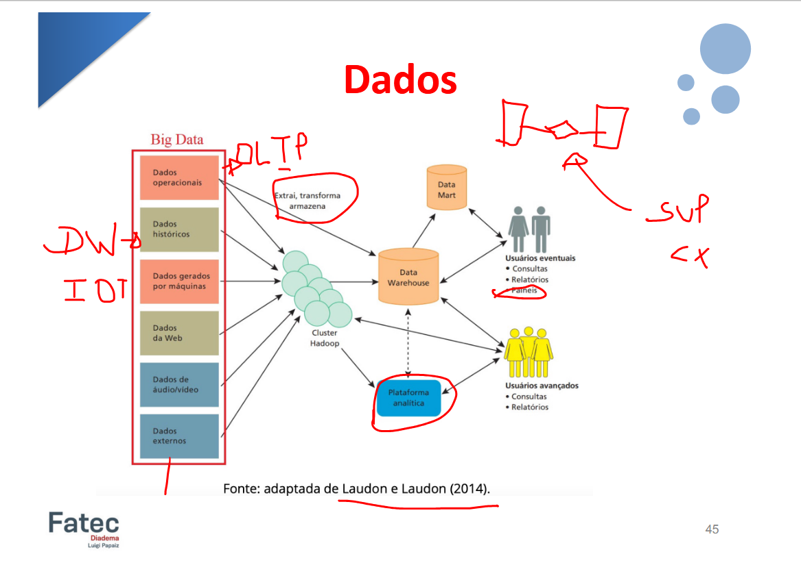

# Aula 2 - Introdução a banco de dados não relacional

Matemática/Estatística + Ciência da computação + Conhecimento de áreas de negócio = **Data Science**
A _Ciência de dados_ é a interseção multidisciplinar que permite extrair valor real da tecnologia.

Dados são a máteria-prima dos negócios, sozinhos não possuem siginificado, mas com contexto eles viram informação, permitindo assima  análise e a criação de insights.

**Tipos de dados:**
* Dados Estruturados: Dados são representados em formato tabular(ou seja já vem formatados);
* Dados Semi-Estruturados: Dados que não possuem um modelo formal de organização;
* Dados Não Estruturados: Dados sem estrutura pré-definida

Bancos de dados tradicionais foram criados apenas para lidar com dados que possam ser armazenados em **Linhas** e **Colunas**. Ou seja são incapazes de lidar com _dados semi-estruturados_ e _não estruturados_. Assim tornando impossível que eles lidarem com **Big Data**(dados gerados em grande volume, alta velocidade e variedade).

Bancos de dados **NoSQL**, são bancos de dados distríbuidos e não-relacionais que foram projetados para atender os requerimentos do _BIG DATA_.

**Big Data** = Coleção de _conjunto de dados, **Grandes e Complexos**_, que não podem ser processados por nacos de dados ou aplicações de processamentos tradicionais. Ou seja esse conceito tem como objetivo tratar grandes volumes de dados, garantindo que **toda e qualquer** informação possam ser encontradas em seus meios.

**Os 4 Vs da big data**:
* Volume - Tamanho dos dados;
* Variedade - Formato dos dados;
* Velocidade - Geração dos dados;
* Veracidade - Confiabilidade dos dados;

**Algumas aplicações**:
* Manufatura: 
    * Industria Textil -> sensores-IOT -> sinais = dados = tempo de vida útil da máquina e etc;
    * Previsões;
    * Alto volume de dados;
    * Aplicar técnicas de análise para extrair dados;

* Saúde:
    * Prontuário eletrônico -> informações ao longo da vida do paciente, previsão de doenças, analisar a eficiência de medicamento;
    * IA -> Segmentação de imagens médicas, reconhecer doenças atráves de imagens;
    * Monitoramento de sinais vitais;
    * Redução da taxa de retorno dos pacientes;
    * medicamentos personalizados;

**Conclusão: o valor dos dados**
* Evolução: Saímos de tabelas rígidas(SQL) para sistemas fluídos e escaláveis (NoSQL).
* Integração: Data Science é a ponte entre a tecnologia e o negócio.
* Ubiquidade: da prevenção de doenças à colheita da fazenda, o _Big Data_ está redefinido todos os setores.

# Aula 3 - Dados estruturados e não estruturados

**O modelo Relacional**
A represetação dos dados ocorre por tabelas.
* Linhas: Registros com endereço único(ID/chave);
* Colunas: Atributos e características dos dados;
* Relações: A conexão entre valores registrados e seus atributos;

**Revisão do que é banco de dados relacional**:
banco baseado no modelo relacional, a representação dos dados ocorre por **tabelas**, em que cada _linha_ é um **registro com o seu endereço**, que também pode ser chamado de **ID ou de chave**. Na tabela, as _colunas_ têm as características, que são chamadas de **atributos dos dados**. As relações entre os dados são a razão pela qual esse tipo de banco tem o seu nome, pois, para cada atributo haverá um **valor registrado que o relaciona com os respectivos dados**.

**Linguagem de consulta estruturada(SQL)**:
* Definição: Linguagem padrão para criar e consultar informações em grandes volumes de dados.
* Base Matemática: Fundametada na álgebra relacional, garantindo lógica estrita.
* Vantagem: Consistência interna superior, ideal para processamento rápido e confiável.

**SQL: A linguagem da Precisão**
* Definição: SQL(Structured Query Language) é o padrão para criar e consultar dados;
* A base: Fundamentada na Álgebra Relacional;
* O benefício: Linguagem matemática consistente que garante confiabilidade para grandes volumes de dados estruturados;

**O padrão ACID**

A -> Atomicidade: Tudo ou nada, todas devem ser realizadas com sucesso ou nenhuma é realizada -> Indivisibilidade;
C -> Consistência: Garante que todas as restrições e regras sejam mantidas antes e depois de transações -> Coerência;
I -> Isolamento: Garante que as transações ocorram em paralelo, sem interferir uma na outra(existem 4 níveis de isolamento: leitura não confirmada, leitura confirmada, repetição de leitura e serializável) -> Bloqueado;
D -> Durabilidade: Garante que alterações feitas numa transação sejam permanentes. -> Persistência;

**A Fronteira NoSQL**

***Not Only SQL***
* Definição: Termo genérico para bancos de dados que não utilizam o modelo relacional de tabelas rígidas.
* Propósito: Projetados para gerenciar grandes volumes de dados não estruturados que o modelo relacional luta para processar.

**O que é NoSQL**
* Definição: Um termo genérico para bancos que não utilizam o modelo relacional rígido.
* Propósito: Projetados para gerenciar grandes volumes de dados com flexibilidade total.

**Entendendo a Escalabilidade e Disponibilidade**
* Escalabilidade: Planejamento para picos súbitos de acesso e decréscimo _sem travar o sistema_. Ou seja diz respeito a quantidade de usuários que acessam o banco de dados.
* Disponibilidade: Informação em tempo real, independente do horário ou localização(crítico para redes sociais e bancos.)

**Os 3 pilares da performance moderna**
1 - Escalabilidde: Capacidade de lidar com o crescimento ou decréscimo massivo de usuários sem travar.
2 - Alta Disponibilidade: Acesso garantido 24/7. O sistema nunca dorme.
3 - Otimização para ambientes onde os dados estão espalhados por múltiplos servidores.

**Gerenciando o caos de tráfego(picos de acesso)**
* Escalabilidade Dinâmica: Reação imediata à rapidez com que o número de usuários sobe ou desce;
* Tempo Real: Informação disponível instantaneamente independente de horário ou local.

**Big Data e NoSQL**
Os bancos de dados NoSQL são projetados para gerenciar grandes volumes de dados e permitir:
* alta escalabilidade;
* disponibilidade;
* Desempenho em ambientes distribuídos(AWS SRV).

O processamento e a modelagem dos dados possuem **3 pilares**:
* Tecnologias de _big data_;
* Ferramentas de analytics(_ETL_);
* Ferramentas de BI(_PowerBI_);

A **Flexibilidade** trata da maneira que os dados são armazenados, a _flexibilidade_ é importante para que os dados possam ser acessados por diversas tecnologias, aplicativos e clientes. Assim conseguindo armazenar _dados estruturados e não estruturados_.

**BD - Dados Estruturados**:
Dados estruturados são aqueles que possuem um _formato definido e organizado_, geralmente armazenados em tabelas com colunas e linhas, como em um banco de dados relacional.
Os campos são claramente definidos e tem um tipo específico de dado como números.

**BD - Dados semi-estruturados**
Dados semi-estruturados são aqueles que possuem uma _estrutura parcialmente definida_, mas ainda são organizados de alguma forma. Como por exemplo XML, JSON ou YAML.
Esse tipo de dado pode conter informações adicionais como **tags e metadados**.

**BD - Dados não estruturados**
Dados não estruturados são aqueles que _**não** possuem uma estrutura claramente definida_ e **não** são organizados em tabelas ou formatos específicos.
Esses dados podem ser de vários tipos, como texto livre, imagens, vídeos, áudio ou mensagens de redes sociais.

**Resume da Arquitetura de Dados**:
|Relacional(SQL) | Não-Relacional(NoSQL) |
|----------------|-----------------------|
|Estrutura rígida(tabelas) | Flexibilidade(Documentos/Gravos) |
|ACID(Segurança Total) | Escalabilidade e alta disponibilidade |
|Consistência Matemática | Performance em ambientes Distrbuídos |

