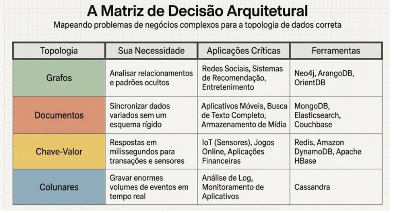
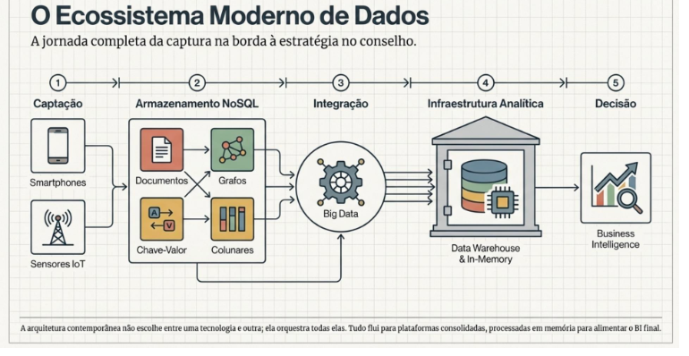

# BD não relacional - Aula 09 - Estudo sobre os conceitos de aplicações não convencionais

***Os 4 Pilares da Arquitetura NoSQL***
* Chave-Valor: Velocidade extrema para leituras e gravações simples;
* Documentos: Flexibilidade total para estruturas dinâmicas como o JSON;
* Grafos: Especializado em mapear conexões e relacionamentos complesxos;
* Colunares: Otimizados para registrar e consultar eventos sequenciais em massa;

**Bancos colunares** são a solução robusta para o universo infinito do monitoramento de máquinas e sistemas.
Desafio da observalidade(_cassandra_): Sistemas modernos geram bilhões de eventos por segundo. **Bancos colunares** permitem que as empresas gravem gigantescos volumes de dados de log simultaneamente, sem travar a escrita, mantendo a capacidade de realizar consultas analíticas de forma supreendentemente rápida.

## Conclusão

Essas aplicações não convencionais são possíveis porque os bancos de dados não relacionais oferecem uma maior flexibilidade e escalabilidade em comparação com os bancos de dados relacionais.
Eles permitem que as empresas armazenem e analisem grandes quantidades de dados de maneiras que antes eram impossíveis.

**Data wareHouse e Data Marts**

Dados precisos precisam de ambientes controlados e focados na decisão.
* Fonte: Big data & SO;
* O cofre: data warehouse, banco histórico onde os dados são corrigidos e combinados, acessíveis mas nunca editáveis.
* O Foco: Data marts(vendas, RH...), versão menor e destilada atendendo exclusivamente a um departamento específico.

Nada mais é do que um banco de dados recorrente potencial para as tomadas de decisões empresariais.
> A origem desses dados está nas transações operacionais da empresa (vendas, manufatura, produção, etc.) e, também, em fontes externas (LAUDON; LAUDON, 2014)

A data warehouse gera **relatórios de gerenciamento** por meio da **combinação** entre os **dados internos e externos**.

> Há també m a data mart, uma espé cie de versão menor da data warehouse com um volume resumido ou selecionado de dados, colocado em um banco especí fico destinado a atender um setor ou departamento em especial (LAUDON; LAUDON, 2014)

**Plataformas Analíticas de alta Performance**

Hardware e Software trabalhando em uníssono para esmagar o tempo de processamento. Plataformas dedicadas integram tecnologias relacionais e NoSQL para processar grandes grupos de dados.

Baseadas em tecnologia de informação relacional e não relacional (NoSQL), tem a função de analisar grandes grupos de dados e promover consultas.
> Segundo Laudon e Laudon (2014) são capazes de oferecer um processamento de 10 a 100 vezes mais rápido em comparação com os tradicionais sistemas de informação.

**Ecossistema moderno de dados**

**Computação em memória**

Outra ferramenta constituinte da infraestrutura de utilização de Big Data é a in-memory (computação em memória),
Baseia-se na memória principal de um computador, a **memória RAM**, responsável por realizar o armazenamento de dados.

O acesso aos dados da memória RAM, é **muito mais rápido** do que o acesso em armazenamento de discos rígidos dos tradicionais sistemas

> O interessante no armazenamento em memória é que sua capacidade é **equivalente a um data mart ou até mesmo de um data warehouse de pequeno porte**, mas com a vantagem de processar cálculos que antes demoravam horas, e que agora necessitam de poucos segundos (LAUDON; LAUDON, 2014)

