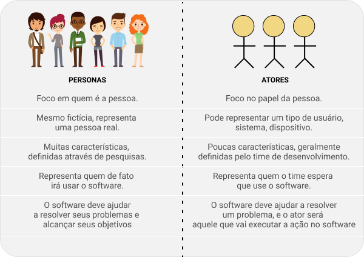

# Aula 04 - Personas

[Nessa aula o professor deixou esse artigo para lermos](https://guia.dev/pt/pillars/business/personas.html).

Persona é a representação **fictícia do cliente ideal para um negócio**. É baseada em dados e características de clientes reais como: comportamento, dados demográficos, problemas, desafios e objetivos.

## Persona VS Atores

Um ator nas definições de UML, é a representação de um papel ou tipo de usuário dentro de um caso de uso.Desta forma um ator não possui profundidade com relação a quem de fato pode ser esse usuário.
**O que acaba criando softwares difíceis de usar.**

A persona nasceu justamente para aprofundar a visão com relação aos atores. Abaixo um comparativo que ilustra melhor a diferença entre eles:

Uma persona não substitui em todas as situações a figura do ator, principalmente quando o usuário do software refere-se a um **sistema ou dispositivo**.

## Personas do Negócio

As personas normalmente são elaboradas pelos profissionais de design, produto, negócio ou marketing.
**Elas são fruto de um trabalho de pesquisas com clientes ou possíveis clientes.**