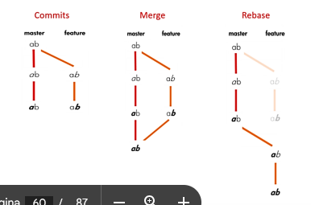

# TP 05 Versionamento trabalho em equipe

As ramificações (BRANCHS) funcionam como uma abstração para o processo de edição/estágio/confirmação.
Branches ("ramos") são utilizados para desenvolver funcionalidades isoladas umas das outras.

[Recomendação de leitura sobre branchs](https://git-scm.com/book/pt-br/v2/Branches-no-Git-Branches-em-poucas-palavras)

## Unindo trabalhos - MERGE

Quando temos 2 branchs diferentes, desenvolvidas separadamente e queremos juntá-las fazemos um merge.

## Atualizando uma branch - REBASE

Quando queremos unir branchs mas sem fazer um novo commit, nós usamos o rebase, que pega o conteúdo de uma branch e acrescenta na outra.

## Diferença de MERGE e REBASE

O rebase e a merge são projetados para integrar as alterações de uma ramificação em outra, mas de maneiras diferentes.

Por ex. digamos que temos commits como abaixo, o merge resultará como uma combinação de commits, enquanto o rebase adicionará todas as alterações no branch feature a partir do último commit do branch master:

