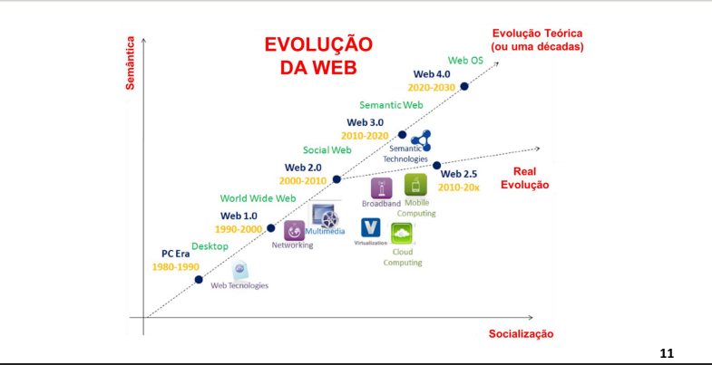
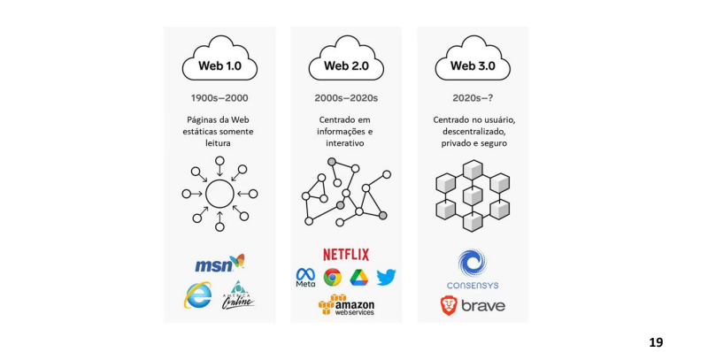

# DevWeb_04 - Introdução dev.web

## Introdução 

**Revolução dos computadores e internet(WEB)**

A internet que conhecemos hoje é resultado de uma série de evoluções tecnológicas que se iniciou na década de 40 para 50; Nesta época temos os computadores de 1a e 2a Geração (com o uso de reles e válvulas).

Na década de 70 com a introdução dos materiais semicondutores, os computadores diminuíram seu tamanho significativamente e ganharam um poder computacional muito além dos seus anteriores.

Entre 1970 e 1980, ocorreu a Guerra Fria entre EUA e União Soviética permite o surgimento da **ARPANET** (primeira rede de computadores).

A Internet funciona através de três protocolos (parâmetros) de dados:
* URL - que especifica o endereço único que cada página vai receber, e é como ela vai ser encontrada quando os usuários digitarem;
* HTTP - que é um protocolo de comunicação que permite a transferência de informação entre redes;
* HTML - que é um método de codificar a informação da internet, para ser exibida de diversas maneiras.

A Lei de Moore dita a regra da “corrida de evolução computacional”. Moore afirma que o número de transístores dobraria a cada dois anos(Lei de moore significa mais desempenho).

**Evolução da Internet**

Quando houve sua criação, tinha proposito único de compartilhar dados, textos, informações militares, serviços governamentais e centros de pesquisas.

As primeiras interfaces gráficas (GUI) se tornaram um “divisor de águas” na Interação Humano-
Computador e hoje? Como é essa relação? A resposta é dividida em 3 grandes marcos (Web 1.0, Web 2.0 e Web 3.0).
As principais diferenças entre esses formatos da Web estão na **dinâmica e interatividade**.

Um site da **Web 1.0** é totalmente estático, sem nenhuma forma de interatividade com os leitores (puramente textos), formais e jornalísticos.
O usuário pode visitá-lo muitas vezes, mas não haverá nada de novo em todas as novas visitas.

Bill Gates na conferência MIX06 em março de 2006 citou a **Web 2.0** como: 
> “Não podemos ser centrados nos dispositivos... temos de nos centrar no usuário”.

A **Web 2.0** não se refere à modernização nas tecnologias, mas a uma mudança de como ela é entregue e percebida pelos _usuários e desenvolvedores_ (do ambiente de interação e participação do usuário).
A **Web 2.0** é um conjunto de técnicas para design, novas tecnologias e execução de páginas da Web.

A **Web 2.5** é o conceito para abordar a evolução prática e real que estamos vendo atualmente em nossa era 2010-2020 entre Web 2.0 e 3.0.
A caminho da Web 3.0 alguns players como Amazon, Google, Salesforce, KiSSFLOW etc, fornecem um modelo de serviço em **Cloud Computing** para desenvolvedores criarem _aplicativos web_ para seus usuários se conectarem em qualquer dispositivo, a qualquer hora e em qualquer lugar.
A Web 2.5 está focando principalmente na computação móvel e na evolução das tecnologias móveis.

**Web 3.0** é o nome dado a uma nova fase na evolução da internet. Consequência do impacto da 4a Revolução Industrial com o uso de Inteligência Artificial, Criptomoedas, Blockchain, Internet das Coisas, etc.
Tem como _característica_ uma **maior descentralização, maior segurança** (a Lei Geral de Proteção de Dados – é consequência dessa transição);

Hoje **qualquer usuário** tem a possibilidade de criar seu comercio (e-commerce), montar seu canal de comunicação (PodCast, VideoCast, etc) e ter voz ativa em redes sociais, juntando-se com outros pares de mesmos propósitos.

A utilização de softwares chamados “user-friendly” de programação e design (amigáveis) já é uma realidade.

A Web 3.0 vai além da interação, são páginas em formatos personalizados, com conteúdo de maior relevância de acordo com as preferências de cada pessoa.

Dentro desta linha de raciocínio, Peter H. Diamandis é o autor do Framework no qual é conhecido como os “6Ds do Exponenciais”.
Os 6Ds do Exponencias são: 
**Digitalização**: ***Qualquer coisa que se torna digitalizada entra na lógica do crescimento exponencial***. A informação digital é fácil de acessar, compartilhar e distribuir. Ela é transmitida na velocidade da internet e muda desde o campo do entretenimento e informação até o da construção e da medicina. Ou seja, um produto adquire poder exponencial assim que muda de físico para digital;

**Decepção**: ***No começo, qualquer inovação pode enganar e parecer decepcionante***. Esse é o conceito de uma **curva exponencial**. Se alguém desistir antes da hora, poderá perder oportunidades. No entanto, quem perseverar, terá um mar de opções para explorar.

**Disrupção**: ***Em termos simples, uma tecnologia disruptiva é qualquer inovação que cria um mercado e abala outro já existente.*** Por exemplo... quando temos câmeras superpotentes em nossos
smartphones, para que comprar uma câmera com filme e rolos?.

**Desmonetização**: **Uma consequência direta da disrupção costuma ser a desmonetização.** Ao passo em que tecnologias se tornam mais baratas e acessíveis, o preço de serviços vai ficando cada vez mais barato até que, muitas vezes, chega a zero.

**Desmaterialização**: ***A desmaterialização consiste no desaparecimento dos próprios produtos e serviços***. Walk-talk, câmera, livros... hoje todos cabem no seu bolso. E não porque eles viraram diversas tecnologias pequenas. Eles se desmaterializaram. São serviços na nuvem que chegam a nós em forma de aplicativo ou de um sistema rodando em um navegador.

**Democratização**: Por fim, quando algo se torna digitalizado e desmonetizado, mais pessoas podem ter acesso a isso. E aí o mundo começa a mudar, porque as pessoas estão tecnologicamente empoderadas. Um exemplo disso é a conectividade sem fio, que permite a comunicação de tais dispositivos com a internet.

## Dev. Web hoje

**O desenvolvimento Web nos dias atuais, deixou de ser um simples site com arquivos informações e passou a ser “softwares” em plataformas.**

**INTERNET**: A Internet é uma rede de computadores que permite a ligação de todos os computadores (e outros dispositivos) entre si. Em outras palavras, a internet é uma rede global que liga redes de computadores.

**WEB/World Wide Web**: A WEB é uma teia de páginas contendo texto, imagens, som etc., com ligações diferenciadas entre si, disponíveis em computadores presentes na Internet.

**AJAX(ASYNCHRONOUS JAVASCRIPT AND XML)**

AJAX de uma forma mais detalhada é a possibilidade de aplicações WEB/Mobile _acessar(chamar) um recurso no servidor_ a partir de codificação JavaScript em um navegador e essa chamada dever ser feita de forma assíncrona (sem o processo ficar aguardando o seu retorno).

As chamadas pelos navegadores do cliente são feitas (ambas) em HTTP Request (como toda aplicação Cliente-Servidor).

Em contrapartida o retorno diferencia entre os modelos: o modelo de aplicação clássica, _o retorno é feito em HTML com CSS_ (necessitando atualizar todo a interface denavegação) e no modelo de aplicação AJAX, **o retorno é feito em XML**.