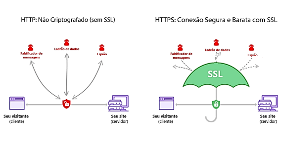

# DW3 - aula 08 Serviços Web, fundamentos e protocolos.

> Não há resumo das aulas 05 até 07, pois estas são os mesmos materiais de github revisados em TP2, caso você queira vê-los siga este link [Estudo sobre github 1](../TP2/Tp03.md).

## Fundamentos web

**Protocolo HTTP**

HTTP é um protocolo de comunicação (conjunto de regras). Esta definida na [Documentação](https://datatracker.ietf.org/doc/html/rfc2616);

HTTP tem sua principal utilização em navegadores de internet. Isso se deve pelo fato de ser um protocolo na pilha TCP/IP (comunicações Web).

**Criação e evolução do HTTP**

O HTTP foi originalmente projetado para ser usado em conjunto com o HTML.

O HTTP é um protocolo cliente-servidor, ou seja, ele permite que um navegador (o cliente) solicite informações de um servidor web e receba uma resposta.

Protocolos com funcionalidades especificas (similares ao HTTP):

* ***HTTPS (HTTP Secure)***: uma _versão do HTTP_ que **utiliza criptografia SSL/TLS** para proteger as informações transmitidas entre o cliente e o servidor. O HTTPS é uma evolução natural do HTTP e oferece maior segurança e privacidade na web.
* ***SPDY***: um protocolo desenvolvido pelo Google que tem como **objetivo melhorar a velocidade de carregamento de páginas web**, reduzindo o tempo de espera entre as solicitações do cliente e as respostas do servidor.
* ***HTTP/2***: uma versão mais recente do HTTP que introduziu novas funcionalidades para melhorar o desempenho da web, como a compressão de cabeçalhos e a multiplexação de conexões.
* ***QUIC***: um protocolo de transporte desenvolvido pelo Google que **visa reduzir a latência e melhorar a segurança da web, combinando elementos do TCP e do UDP**.
* ***WebSockets***: um protocolo que permite que uma **conexão bidirecional** entre o cliente e o servidor seja estabelecida, **permitindo a transmissão de dados em tempo real**.

A comunicação de rede acompanha alguns itens de comunicação (pacotes e arquivos): endereços de URLs, métodos, endereços, etc.

**Protocolo - HTTPS**

HyperText Transfer Protocol + Secure Sockets Layer / Transport Layer Security;

**Certificado Digital**

Para que a conexão seja segura (HTTPS), exige a necessidade de uma identificação no qual chamamos de **CERTIFICADO DIGITAL**.
O Ceritificado Digital, apresenta uma “chave” que vai **criptografar os dados** que serão enviados. Chamamos essa chave de **CHAVE PUBLICA**.
No outro lado (servidor), haverá uma chave que apenas o desenvolvedor (proprietário) vai conhecer no qual _assina a certificação_ no qual chamamos de **CHAVE PRIVADA (CHAVE SECRETA)**.

As chaves estão ligadas matematicamente, o que foi cifrado pela chave pública **só pode ser decifrado pela chave privada**.
Isso garante que os dados cifrados pelo navegador (chave pública) só podem ser lidos pelo servidor (chave privada).

Como temos duas chaves diferentes envolvidas, esse método de criptografia é chamado de criptografia assimétrica. No entanto, a criptografia assimétrica tem um problema, **ela é lenta**.

Por outro lado, temos a **criptografia simétrica**, que usa a mesma chave para cifrar e decifrar os dados.
_Mais rápida porém menos segura_.

o HTTPS usa **ambos os métodos** de criptografia, assimétrica e simétrica. Uma chave só para _ele e o servidor com o qual está se comunicando naquele momento!_ Essa chave exclusiva (e simétrica) é então enviada para o servidor utilizando a criptografia assimétrica (chave privada e pública) e então é utilizada para o restante da comunicação.
**O HTTPS começa com criptografia assimétrica para depois mudar para criptografia simétrica.**

**Web Server**

Um web server, é um computador ou programa que é responsável por fornecer conteúdo e recursos da web para os usuários que acessam a internet.

O servidor web também pode executar outras funções, como processamento de formulários de contato, verificação de senha de usuários e armazenamento de dados em bancos de dados.

Quando falamos de um Web Service, sempre usamos o protocolo da web, ou seja o HTTP. Um Web Service disponibiliza uma funcionalidade na web, através do protocolo HTTP.

A grande diferença de um Web Service é que os dados não vem no formato HTML, e sim em algum formato **independente da visualização, como XML ou JSON.**

**REQUEST**

Uma Request é um pedido que um cliente faz ao servidor, contendo informações sobre o que o cliente precisa.

Sempre que o usuário interage com uma aplicação web, como ao mudar de página ou pressionar enter na barra de endereço, uma nova request é feita, independentemente da ação realizada, seja para exibir uma página, cadastrar, atualizar ou excluir um recurso.

**RESPONSE**

A response pode conter os dados que o cliente solicitou, ou uma mensagem de erro caso algo tenha
dado errado.

Em resumo, a Response é a resposta que o servidor envia de volta para o cliente após receber a Request.

**CATEGORIA DO HTTP:**

Os códigos HTTP (ou HTTPS) tem três dígitos, sendo que o primeiro dígito do código significa a classificação dentro das cinco categorias.

* 1XX: Informativo – a solicitação foi aceita ou o processo continua em andamento;
* 2XX: Confirmação – a ação foi concluída ou entendida;
* 3XX: Redirecionamento – indica que algo mais precisa ser feito ou precisou ser feito para completar a solicitação;
* 4XX: Erro do cliente- indica que a solicitação não pode ser concluída ou contém a sintaxe incorreta;
* 5XX: Erro no servidor – o servidor falhou ao concluir a solicitação.

Traduzidos para o português estes termos significam **código de status e frase razão**, que são os elementos que compõe o HTTP.

S**tatus-code são os três dígitos que indicam qual o erro para o servidor e navegador** enquanto **a frase razão é uma curta descrição do que este erro significa** para melhor compreensão dos usuários.

[Tabela de códigos e razões descritos](https://www.w3.org/Protocols/rfc2616/rfc2616-sec6.html#sec6.1.1)
[Site para testar status de códigos http](https://savanttools.com/test-http-status-codes)

**PORTAS**

Em um servidor, tem diversas portas que representam serviços, comunicações de acessos;
O HTTP usa a porta 80. no HTTPS usa a porta 443.

As portas permitem que _diferentes serviços_ sejam executados em um **único servidor** compartilhando o mesmo endereço IP, e para garantir que as solicitações HTTP sejam enviadas ao serviço correto no servidor.

Por padrão, o HTTP utiliza a porta 80 para solicitações não criptografadas (HTTP) e a porta 443 para solicitações criptografadas (HTTPS). No entanto, é possível configurar o servidor para utilizar outras portas para serviços específicos, como o SMTP (Simple Mail Transfer Protocol) para e-mails.

**Principais portas e finalidades:**

* ***Porta 80***: Acesso a páginas web através do protocolo HTTP (Hypertext Transfer Protocol).
* ***Porta 443***: Acesso a páginas web através do protocolo HTTPS (Hypertext Transfer ProtocolSecure), que é utilizado para garantir a segurança na transmissão de informações.
* ***Porta 21***: Conexões FTP (File Transfer Protocol), utilizadas para transferência de arquivos.
* ***Porta 22***: Conexões SSH (Secure Shell), utilizadas para acesso remoto seguro a servidores.
* ***Porta 25***: Conexões SMTP (Simple Mail Transfer Protocol), utilizadas para envio de e-mails.
* ***Porta 110***: Conexões POP3 (Post Office Protocol version 3), utilizadas para recebimento de e-mails.
* ***Porta 143***: Conexões IMAP (Internet Message Access Protocol), utilizadas para acesso a e-mails em servidores.
* ***Porta 53***: Conexões DNS (Domain Name System), utilizadas para resolver nomes de domínios em endereços IP.

Para saber _qual porta está sendo utilizada em um computador com Windows_ no Prompt de Comando, basta utilizar o comando ``netstat``. O comando ``netstat`` permite **visualizar as conexões de rede ativas no computador**, incluindo as portas que estão sendo usadas.

Digite o comando ``netstat -ano`` para exibir uma lista de **todas as conexões de rede ativas no computador**, juntamente com as portas associadas a elas.

**PORTQRY - PORTQRY COMMAND LINE PORT SCANNER VERSION 2.0**

Portqry é um utilitário de linha de comando da Microsoft que é usado para verificar o status das portas em um computador.
O Portqry permite verificar se as portas de um determinado host estão abertas ou fechadas, além de exibir informações sobre os serviços que estão escutando nessas portas.
[Link para a instalação](https://www.microsoft.com/en-us/download/details.aspx?id=17148)

Para verificar quais portas estão livres com o Portqry, você pode usar o seguinte comando: ``portqry -n <nome_do_host> -e <número_da_porta>``

**PARAMÊTROS DE REQUISIÇÃO E WEB SERVERS(VERBOS)**

Os métodos GET e POST são usados em requisições HTTP, que são formas de comunicar com um servidor.

Usamos o GET quando **queremos obter informações do servidor**, enquanto o método POST é u**sado quando queremos enviar dados para o servidor para serem processados**, como em um formulário.

**COOKING**

São pequenos arquivos de texto que são armazenados no computador.
São usados pelos sites para lembrar de informações sobre suas preferências, como suas escolhas de idioma ou suas credenciais de login.
Alguns cookies são essenciais para o funcionamento adequado de um site, como cookies de sessão que permitem que fazer login ou carrinho de compras que mantém os itens adicionados durante uma sessão de compras.

**Um cookie é um pequeno arquivo de texto, normalmente criado pela aplicação web, para guardar algumas informações sobre usuário no navegador.**

Um cookie pode ser manipulado e até apagado pelo navegador e, quando for salvo no navegador, fica associado com um domínio.

**SERVIÇOS REST**

**Representational State Transfer** – REST é um modelo utilizado para **projetar arquiteturas de software distribuído, que se baseia na comunicação via rede**.

O modelo REST funciona através de uma arquitetura cliente-servidor, em que o cliente envia requisições para o servidor e o servidor retorna as respostas correspondentes.

A interface é composta por **quatro elementos principais**: _identificação dos recursos, manipulação dos recursos através de representações, mensagens autodescritivas e hipermídia como mecanismo de estado da aplicação_.

O REST utiliza métodos HTTP, _como GET, POST, PUT e DELETE_, para manipular os recursos identificados por URLs.

**As representações dos recursos são trocadas em formato de dados, como JSON ou XML.**

DIFERENÇAS ENTRE OS TERMOS:

**REST** é um modelo arquitetural que define os princípios e restrições para projetar sistemas distribuídos baseados em comunicação via rede. É um modelo abstrato que define os princípios e restrições que devem ser seguidos para se projetar um sistema distribuído baseado em comunicação via rede.

**REST API** (Application Programming Interface) é uma **implementação específica do modelo REST**, que utiliza as suas características e restrições para expor uma interface de programação para acessar recursos de um sistema. É uma aplicação concreta que implementa esses princípios e restrições para expor recursos de um sistema de forma padronizada, permitindo que outros sistemas possam interagir com esses recursos de maneira simples e eficiente.

**Conclusão**: REST API é uma implementação concreta dos princípios do modelo REST, que é utilizado para expor uma interface de programação para acesso aos recursos de um sistema.