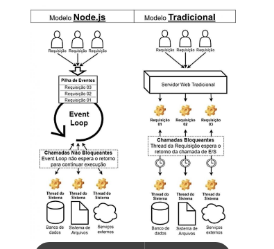
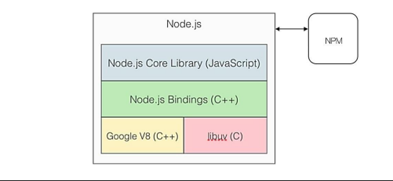

# DW3 - Aula 09 - Node.js introdução e instalação

**Node.js** é um ambiente de runtime (ambiente de execução) para Javascript(server-side) que roda em cima de uma engine conhecida como Google v8.
Ou seja com ele é possível criar aplicações Javascript para rodar como uma aplicação standalone em uma máquina, não dependendo de um browser para a execução;

**Caracteristicas**

A principal característica que diferencia o Node.JS de outras tecnologias (PHP, Java, C#, etc) é o fato de sua execução ser single-thread (apenas uma thread é responsável por executar o código Javascript da aplicação).

Em um servidor web utilizando linguagens tradicionais, para cada requisição recebida é criada uma nova thread para tratá-la.
Uma vez que esses recursos(memoria ram e etc) são limitados, as threads não serão criadas infinitamente, e quando esse limite for atingido, as novas requisições terão que **esperar a liberação desses recursos alocados para serem tratadas**.

Essa única thread é chamada de **Event Loop**, e leva esse nome pois cada requisição é tratada como um evento.
O Event Loop fica em execução esperando novos eventos para tratar, e para cada requisição, um novo evento é criado.

O Node.js consegue o mesmo efeito de um servidor tradicional multi-thread através de **chamadas de E/S (entrada e saída) não-bloqueantes**. Isso significa que as operações de entrada e saída (ex: acesso a banco de dados e leitura de arquivos do sistema) são assíncronas e não bloqueiam a thread.

A diferença de funcionamento de um servidor web tradicional e um Node.JS:

Enquanto o Event Loop delega uma operação de E/S para uma thread do sistema de forma assíncrona e continua tratando as outras requisições que aparecerem em sua pilha de eventos, as threads do modelo tradicional esperam a conclusão das operações de E/S, consumindo recursos computacionais durante todo esse período de espera.

**Arquitetura**

Node.js estende as funcionalidades do JavaScript V8 para poder interagir com o sistema operacional: escrever em arquivos, ler de arquivos, fazer operações de redes, criar subprocessos, entre outros.

Todas as operações de baixo nível, que lidam com o sistema operacional, são feitas de forma assíncrona, por mais que o programa execute em uma única thread.
Para entender como isso acontece, precisamos saber como a plataforma é arquitetada:

No fundo da pilha estão o **V8 e a biblioteca libuv**. Essa biblioteca fornece a **assincronicidade** e o poder de **operações baixo nível da plataforma**: operações de leitura e saída interface de rede — conexão via TCP ou UDP, resolução de DNS entre outros bifurcação de processos e o próprio event loop, que coordena como o Node.js funciona.

**Portanto, o libuv coordena toda a parte de rede, sistema de arquivos e “paralelismo" do Node.js.**

Acima do V8 e libuv está a camada de “colagem” — Node.js Bindings, escrita em C++, que une essas duas tecnologias junto ao sistema operacional, para que funcionem harmoniosamente.

Os módulos principais do Node.js são incluídos na biblioteca padrão da plataforma — Node.js Core Library:
* **HTTP** - módulo responsável pelo servidor HTTP do Node.js
* **UTIL** - Provê funções utilitárias, como depuração, formatação, verificação de tipos, entre outras;
* **QUERYSTRING** - como o próprio nome sugere, implementa funções de query string;
* **URL** - responsável por prover funções utilitárias para análise e manipulação de URL;
* **FS** - lida com operações do sistema de arquivo, como leitura e escrita
* **CRYPTO** - funções de criptografia;
* **PATH** - lida com o caminho no sistema de arquivos do sistema operacional em que a plataforma está rodando.

É importante mencionar que o _gerenciador de pacotes do Node.js, NPM_, executa ao lado dessa arquitetura para prover ao desenvolvedor módulos que implementam inúmeras funcionalidades e não obrigá-lo a "reinventar a roda”.

**JavaScript RunTime**

_O Node tem a capacidade de interpretar código JavaScript, assim como um navegador o faz._

Quando um navegador recebe um comando escrito em JavaScript, ele o interpreta, como que convertendo para uma linguagem de máquina, e em seguida executa as instruções que aquele comando fornece.

Um **CLI** é um _prompt de comando que permite ao usuário inserir comandos_. Tudo que ocorre nesse processo, em termos de comandos JavaScript, é interpretado e executado pelo runtime do Node.

Para que seja possível todo esse processo ocorrer fora de um navegador, o Node utiliza uma ferramenta chamada Chrome's V8 JavaScript engine.

**Arquitetura da proogramação não bloqueante**

_As chamadas entre o cliente e servidor são realizadas de forma assíncronas (não bloqueantes)._
Com o Node.js pelo fato de não necessitar ficar aguardando (síncrono), a chamada é encaminhada ao servidor e outras tarefas são executadas.

Quando a tarefa termina de ser executada, o Node.js **volta a tratar aquela resposta**. Isso permite que soluções sejam implementadas em máquinas mais simples e a escalabilidade da solução se torna mais eficiente e menos onerosa.

**GERENCIADOR DE PACOTE – NODE PACKAGE MANAGER – NPM**

[Site do NPM](https://npmjs.com.)